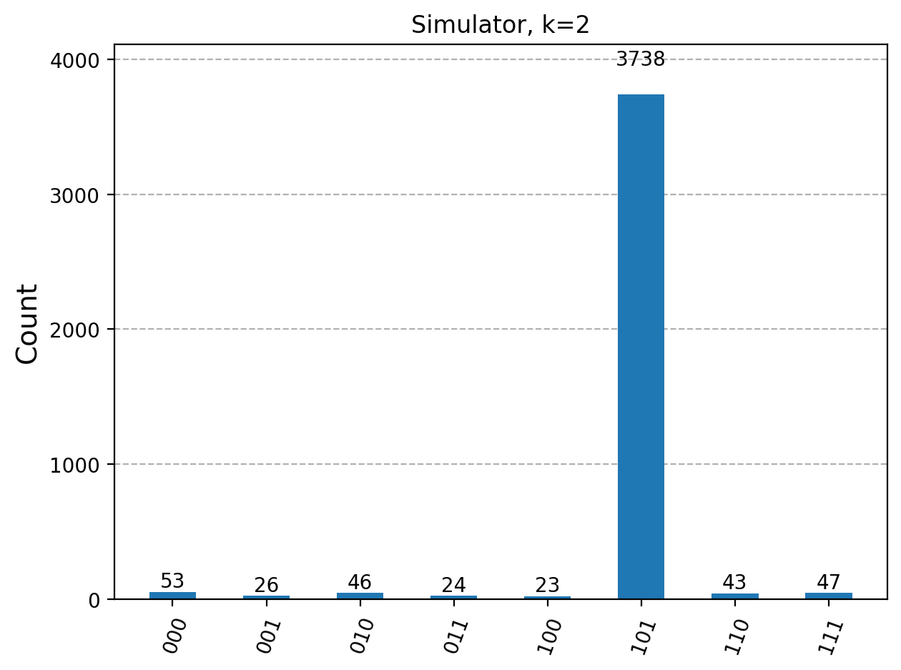

# Grover Search on Real IBM Quantum Hardware

以 Qiskit 實作 3 位元與 4 位元的 Grover 搜尋演算法，比較理論值、無雜訊模擬器與 IBM 真實量子電腦的結果，觀察雜訊對量子計算的影響。

作者：張漢昱（國立成功大學工程科學系）
日期：2026 年 9 月 30 日

## 目的

Grover 演算法在理論上能以約 √N 次查詢找到 N 個狀態中的目標。但現今量子電腦有雜訊，電路越深，結果越不可靠。本專案想回答兩個問題：

1. 在真實硬體上，成功率會比理論值掉多少？掉多少跟電路深度有沒有關係？
2. 理論上的「最佳迭代次數」在真實硬體上是否依然最好？

## 方法

- 程式架構參考 [IBM Quantum 官方 Grover 教學](https://quantum.cloud.ibm.com/docs/en/tutorials/grovers-algorithm)，使用 Qiskit 2.x 與 qiskit-ibm-runtime。
- Oracle：以 X 閘把目標字串中的 0 暫時翻成 1，再用多控制 Z 閘翻轉目標狀態的相位。
- Diffuser：使用 `grover_operator()` 產生，對平均振幅做反射以放大目標機率。
- 目標狀態：3 位元為 `101`，4 位元為 `1011`。
- 模擬器：`StatevectorSampler`（無雜訊）。
- 真機：IBM Quantum Open Plan，電路以 `optimization_level=3` 轉譯後送出，每組 4000 shots。
  - 第 1 次：【待填：機器名稱】
  - 第 2 次：【待填：機器名稱】

理論成功率：

$$P(k)=\sin^2\big((2k+1)\theta\big),\qquad \sin\theta=\sqrt{M/N}$$

其中 N 是狀態總數、M 是目標個數、k 是迭代次數。

## 結果

### 第 1 次真機

| 實驗 | 理論 | 模擬器 | 真機 | 真機／理論 | 轉譯後深度 | 雙位元閘數 |
| --- | --- | --- | --- | --- | --- | --- |
| 3 位元 k=1 | 78.1% | 78.4% | 69.7% | 89% | 72 | 19 |
| 3 位元 k=2（最佳） | 94.5% | 94.4% | 80.0% | 85% | 139 | 39 |
| 4 位元 k=3（最佳） | 96.1% | 95.2% | 58.6% | 61% | 510 | 161 |

### 第 2 次真機（重跑 3 位元 k=1、2、3）

| 實驗 | 理論 | 模擬器 | 真機 |
| --- | --- | --- | --- |
| 3 位元 k=1 | 78.1% | 78.4% | 62.1% |
| 3 位元 k=2（最佳） | 94.5% | 94.4% | 66.0% |
| 3 位元 k=3 | 33.0% | 32.8% | 25.5% |

隨機猜中的機率：3 位元為 1/8（12.5%），4 位元為 1/16（約 6.3%）。

<!-- 有圖的話放這裡，例如：

-->

## 觀察

1. **模擬器與理論相符**：三組模擬器結果與理論值差距都在 1% 以內，確認電路實作正確。剩下的差異來自有限取樣的統計誤差。
2. **雜訊損失隨電路深度增加**：轉譯後雙位元閘從 19、39 增加到 161 個，真機保留的理論成功率也從 89%、85% 降到 61%。真機的原生閘有限、量子位元之間也不是全部直接相連，多控制閘必須拆成大量 CNOT，這是 4 位元電路深度暴增的主因。
3. **最佳迭代次數在真機上仍然最好**：兩次實驗中，3 位元 k=2 都優於 k=1；k=3 則如理論預測下降（第 2 次為 25.5%），但仍高於隨機的 12.5%。在這個規模下，雜訊還不足以抵銷演算法的優勢。
4. **4 位元仍保有訊號**：雖然比理論值低了 37 個百分點，58.6% 仍約是隨機猜測的 9 倍。
5. **不同次執行差異很大**：同一個 3 位元 k=2 電路，兩次真機結果分別是 80.0% 與 66.0%。4000 shots 的統計誤差約只有 ±1%，因此差距可能來自不同的機器、不同的量子位元配置或校準狀態，代表真實硬體的結果需要多次量測才能下定論。

## 下一步

- 加入讀出誤差緩解（readout error mitigation），觀察成功率能回升多少。
- 手動挑選連接性較好、錯誤率較低的量子位元，減少轉譯後的雙位元閘數。
- 在同一台機器上重複多次，估計結果的變異範圍。

## 檔案

- `grover.ipynb`：完整程式與執行輸出（已移除 API key）。
- `*.png`：模擬器與真機的結果直方圖。

## 執行方式

```bash
pip install "qiskit[visualization]>=2.0" "qiskit-ibm-runtime>=0.40"
```

模擬器部分不需要帳號即可執行；真機部分需要 IBM Quantum Platform 的 API key 與 instance，請在執行時手動輸入，不要寫進程式碼。
